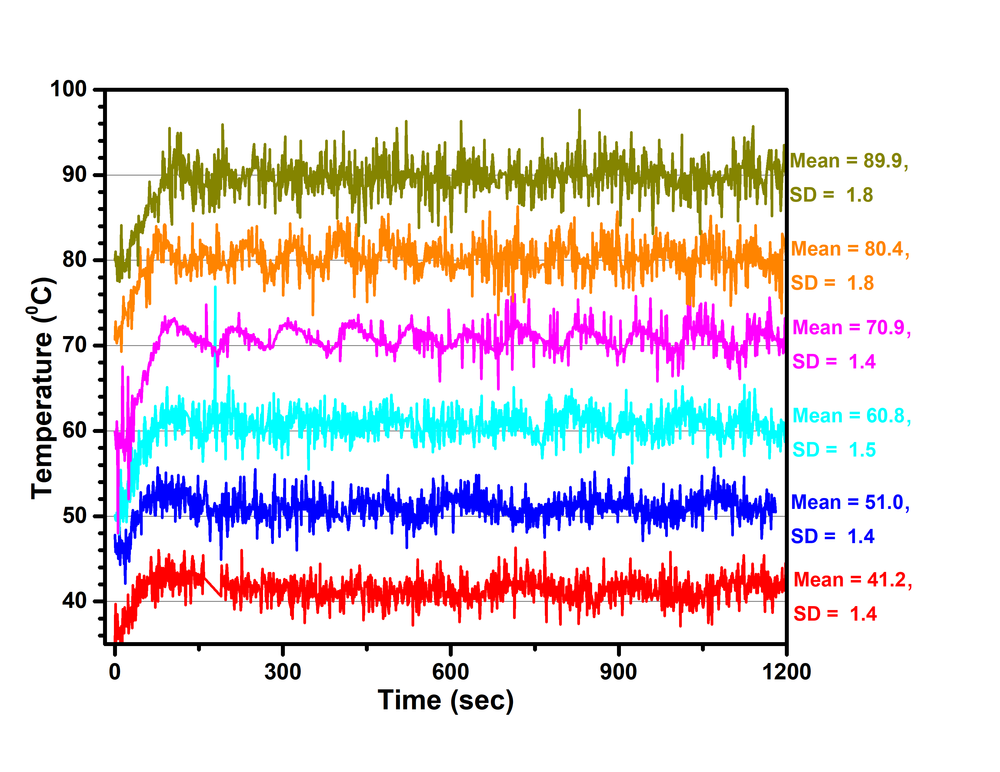
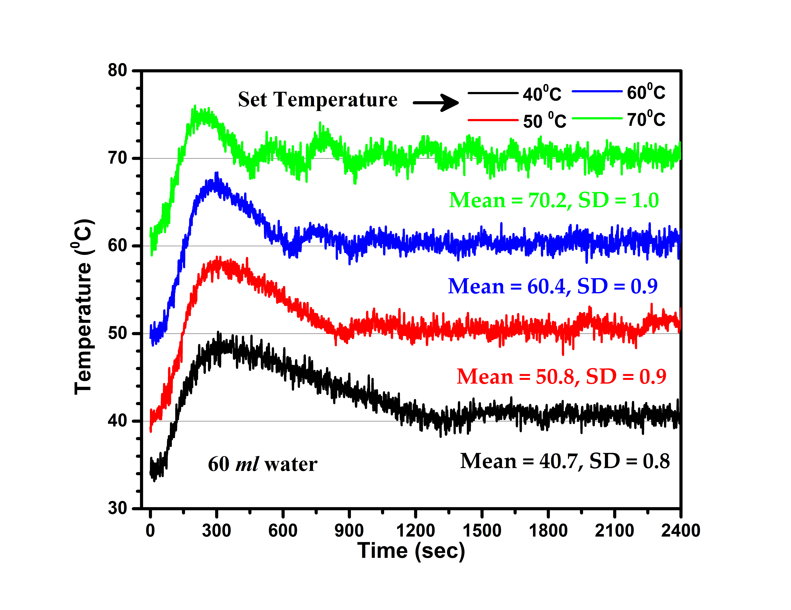

# Temperature-Controller-using-ExpEYES

## Overview:
This project aims to control the temperature of the water bath using a temperature sensor (PT1000), relay module (5V), immersion water heater, and ExpEYES.

## Required Apparatus:
1. ExpEYES model
2. Temperature Sensor (PT1000)
3. Jumper wires (with alligator clips, optional)
6. Glass beaker (500 ml)
6. Mini immersion water heater
7. 5V relay module connected with 220V AC mains plug(5A)

# Procedure:

### Experimental Setup:
1. **Preparation**: Take 400 ml of water in a glass beaker.
2. **Sensor Setup**: Place PT1000 properly in water.
3. **Heater Setup**: Place the mini immersion water heater inside the glass beaker.
4. **Connections**:
   - Connect PT1000 between SEN and Ground.
   - Connect VCC and GND of relay module with ExpEYES.
   - Connect IN of the relay module with OD1 of the ExpEYES.
   - Connect the immersion water heater with 220V AC mains plug.
   - Power ON the AC mains.
5. **Data Acquisition**:
   - Connect ExpEYES to PC via USB.
   - Run the provided Temperature Controller.py file.
   - Data (time, temperature) will be saved to "Temperature.dat".
6. **Graphing**:
   - Plot data for visualization
   - Run the provided "SD.py" file for the histogram plot and SD value.
     
> ### NOTES :
> - Don't forget to delete the existing data file "Temperature.dat", if you run Python script multiple times.

 ## Setup and Connections :
 

 ## Results :
 

  

 ## Special thanks to:

- Heartfelt thanks to Dr. Jithin B.P. from CSpark Research for his invaluable assistance and support. His expertise and guidance were instrumental in the successful completion of this project. Dr. Jithin, your unwavering help and dedication are deeply appreciated.

- Wholehearted thanks to the entire Inter-University Accelerator Centre (IUAC), New Delhi, India team especially Er. V.V.V. Satyanarayana, Mr. Abhijit Sarkar, and Dr. Ajith Kumar B. P. for developing the device and conducting the training program.

## License
This work is licensed under a [Creative Commons Attribution 4.0 International License](https://creativecommons.org/licenses/by/4.0/).

## Author
  - Dr. Ujjwal Ghanta
